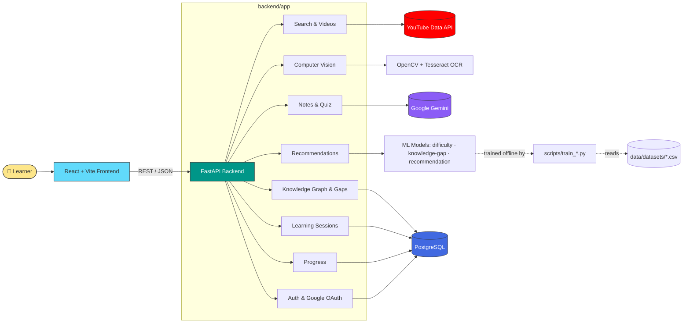
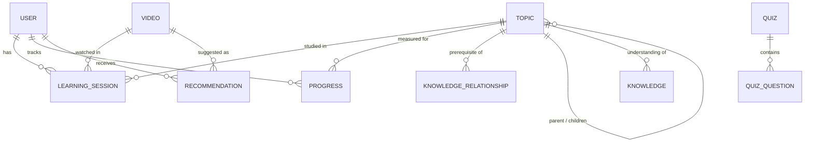

<div align="center">

# 🧠 Learnix

### Turn any YouTube video into a personalized, adaptive learning experience.

AI-driven recommendations · Knowledge-gap detection · Computer-vision video analysis · Auto-generated notes & quizzes · Multilingual by design

[](https://www.python.org/)
[](https://fastapi.tiangolo.com/)
[](https://react.dev/)
[](https://vitejs.dev/)
[](https://www.postgresql.org/)
[](LICENSE)

[Features](#-features) • [Architecture](#-architecture) • [Quick Start](#-quick-start) • [API](#-api-overview) • [Contributing](#-contributing)

</div>

---

## 💡 What is Learnix?

Most people learn from YouTube — but YouTube doesn't know what you already know. **Learnix** sits on top of video content and adds the layer YouTube is missing: it tracks what you understand, spots the gaps in your knowledge, and guides you to the next right video, in your language, at your level.

Feed it a topic. It searches, analyzes the video's transcript *and* its visuals (slides, code, diagrams), scores its difficulty, and slots it into a knowledge graph. As you learn, it builds a picture of you — and recommends what to watch next, generates notes, and quizzes you to check it stuck.

## ✨ Features

<table>
<tr>
<td width="33%" valign="top">

### 🔐 Accounts & Auth
- Email/password + JWT sessions
- Google OAuth login
- Secure password reset flow

</td>
<td width="33%" valign="top">

### 🎯 Personalization Engine
- ML-based difficulty scoring
- Knowledge-gap prediction
- Adaptive video recommendations

</td>
<td width="33%" valign="top">

### 🕸️ Knowledge Graph
- Topic prerequisite mapping
- Readiness checks before new topics
- Gap detection per learner

</td>
</tr>
<tr>
<td width="33%" valign="top">

### 👁️ Computer Vision
- Slide / code / diagram detection
- Scene & text detection (OCR)
- Visual complexity scoring

</td>
<td width="33%" valign="top">

### 📝 AI Study Tools
- Gemini-generated notes
- Auto-generated quizzes + grading
- Semantic topic search

</td>
<td width="33%" valign="top">

### 🌍 Multilingual
- Language auto-detection
- Multilingual embeddings
- Notes & quizzes in `en` / `bn` / `hi`

</td>
</tr>
</table>

## 🏗️ Architecture



<details>
<summary><strong>🗺️ Data model at a glance</strong> (click to expand)</summary>
<br>



</details>

## 🚀 Quick Start

> **Prerequisites:** Python 3.12+, Node.js 18+, PostgreSQL 14+, Tesseract OCR, plus API keys for [YouTube Data API](https://developers.google.com/youtube/v3), [Google Gemini](https://ai.google.dev/), and a Google OAuth client.

### 1️⃣ Clone it

```bash
git clone https://github.com/ankanmaity842-prog/learnix.git
cd learnix
```

### 2️⃣ Backend

```bash
cd backend
python -m venv venv && source venv/bin/activate   # Windows: venv\Scripts\activate
pip install -r requirements.txt

cp .env.example .env       # then fill in DATABASE_URL, JWT_SECRET_KEY,
                            # YOUTUBE_API_KEY, GEMINI_API_KEY, GOOGLE_CLIENT_ID/SECRET

alembic upgrade head       # run migrations
uvicorn app.main:app --reload
```

➡️ API live at **http://localhost:8000** · interactive docs at **http://localhost:8000/docs**

### 3️⃣ Frontend

```bash
cd frontend
npm install
cp .env.example .env       # set VITE_API_URL, VITE_GOOGLE_CLIENT_ID, VITE_GOOGLE_REDIRECT_URI
npm run dev
```

➡️ App live at **http://localhost:5173**

<details>
<summary>🏭 Building for production</summary>
<br>

```bash
npm run build
npm run preview
```

</details>

## ⚙️ Environment Variables

<details>
<summary><strong>Backend — <code>backend/.env</code></strong></summary>
<br>

| Variable | Description |
|---|---|
| `APP_NAME` | Application name (default: `Learnix`) |
| `APP_VERSION` | Application version |
| `DEBUG` | Enable debug mode |
| `DATABASE_URL` | PostgreSQL connection string (`postgresql+psycopg2://...`) |
| `JWT_SECRET_KEY` | Secret used to sign JWTs |
| `JWT_ALGORITHM` | JWT signing algorithm (default: `HS256`) |
| `ACCESS_TOKEN_EXPIRE_MINUTES` | Access token lifetime in minutes |
| `PASSWORD_RESET_TOKEN_EXPIRE_MINUTES` | Password reset token lifetime |
| `YOUTUBE_API_KEY` | YouTube Data API key |
| `GEMINI_API_KEY` | Google Gemini API key |
| `GOOGLE_CLIENT_ID` / `GOOGLE_CLIENT_SECRET` | Google OAuth credentials |
| `GOOGLE_REDIRECT_URI` | OAuth callback URL |
| `FRONTEND_URL` | Frontend origin (used for CORS) |
| `SUPPORTED_LANGUAGES` | JSON list of language codes, e.g. `["en","bn","hi"]` |

</details>

<details>
<summary><strong>Frontend — <code>frontend/.env</code></strong></summary>
<br>

| Variable | Description |
|---|---|
| `VITE_API_URL` | Base URL of the backend API |
| `VITE_GOOGLE_CLIENT_ID` | Google OAuth client ID |
| `VITE_GOOGLE_REDIRECT_URI` | OAuth redirect URI for the frontend |

</details>

> ⚠️ Never commit real `.env` files — copy from `.env.example` and keep secrets out of version control.

## 🧬 Database Migrations

```bash
alembic revision --autogenerate -m "describe your change"   # after editing models
alembic upgrade head                                          # apply
alembic downgrade -1                                           # roll back one step
```

## 🤖 ML Models & Datasets

Training data lives in `data/datasets/` and feeds three models consumed by `backend/app/ai/` at runtime:

| Script | Trains | Algorithm |
|---|---|---|
| `train_difficulty_model.py` | Video difficulty classifier | `RandomForestClassifier` |
| `train_knowledge_gap_model.py` | Knowledge-gap classifier | `RandomForestClassifier` |
| `train_recommendation_model.py` | Recommendation ranker | `RandomForestRegressor` |

```bash
python scripts/prepare_datasets.py
python scripts/train_difficulty_model.py
python scripts/train_knowledge_gap_model.py
python scripts/train_recommendation_model.py
```

## 📡 API Overview

All routes are prefixed with `/api`. Once the backend is running, explore them live at **`/docs`** (Swagger UI).

<details open>
<summary><strong>Click to expand the full route table</strong></summary>
<br>

| Router | Prefix | Purpose |
|---|---|---|
| `auth` | `/api` | Register, login, logout, current user, password reset |
| `google` | `/api` | Google OAuth login/callback |
| `search` | `/api/search` | Search topics/videos |
| `videoes` | `/api/videos` | Video metadata, transcripts, analysis |
| `recommendations` | `/api` | Personalized and topic-based recommendations |
| `learning` | `/api` | Learning session lifecycle (start, event, progress, complete, history) |
| `notes` | `/api/notes` | AI-generated notes |
| `quiz` | `/api/quiz` | AI-generated quizzes and submission grading |
| `progress` | `/api/progress` | Progress dashboard, weekly/topic breakdowns |
| `knowledge` | `/api` | Knowledge map, gaps, prerequisites, topic readiness |
| `vision` | `/api/vision` | Computer-vision video analysis and frame extraction |
| `language` | `/api/languages` | Supported languages and language detection |

`GET /health` → liveness check · `GET /` → app name/version/status

</details>

## 🗂️ Project Structure

```
learnix/
├── backend/
│   ├── app/
│   │   ├── ai/                 # Difficulty, embeddings, recommendations, Gemini client
│   │   ├── api/                 # FastAPI routers
│   │   ├── computer_vision/     # Frame extraction & slide/code/diagram/text detection
│   │   ├── core/                 # Logging, middleware, security, caching, rate limiting
│   │   ├── database/             # Connection, CRUD helpers, migrations
│   │   ├── models/               # SQLAlchemy ORM models
│   │   ├── multilingual/         # Language detection, routing, multilingual NLP
│   │   ├── schemas/               # Pydantic request/response schemas
│   │   ├── services/              # Business logic layer
│   │   ├── utils/                  # Helpers, validators, scoring, text processing
│   │   ├── config.py                # App settings (env-driven)
│   │   └── main.py                  # FastAPI entrypoint
│   ├── alembic/                      # DB migrations
│   ├── tests/                        # Unit + integration tests
│   └── requirements.txt
├── frontend/
│   └── src/
│       ├── components/                # Reusable UI components
│       ├── pages/                     # Dashboard, Search, Quiz, Profile, etc.
│       ├── context/ · hooks/ · services/ · utils/
├── data/datasets/                      # CSV training data
├── scripts/                             # Model training / dataset prep
└── LICENSE
```

## 🧪 Running Tests

```bash
cd backend
pytest
```

Organized under `backend/tests/unit` and `backend/tests/integration`.

## ☁️ Deployment Checklist

- [ ] Target Python 3.12 (see `runtime.txt`); deploy on any ASGI host (Render, Railway, Fly.io, or a container with Uvicorn/Gunicorn workers)
- [ ] Run `alembic upgrade head` as part of your deploy pipeline
- [ ] Build the frontend (`npm run build`) and serve `frontend/dist` via a static host/CDN
- [ ] Point production `VITE_API_URL` at your deployed backend
- [ ] Install Tesseract OCR on the backend host so computer-vision features work
- [ ] Set `DEBUG=false` and rotate/strengthen `JWT_SECRET_KEY` and all API keys

## 🤝 Contributing

Contributions, issues, and feature requests are welcome!

1. Fork the repo
2. Create your branch (`git checkout -b feature/amazing-thing`)
3. Commit your changes (`git commit -m "Add amazing thing"`)
4. Push and open a PR

## 📄 License

Licensed under the [Apache License 2.0](LICENSE).

---

<div align="center">

If Learnix helped you learn something faster, consider ⭐ starring the repo.

</div>
