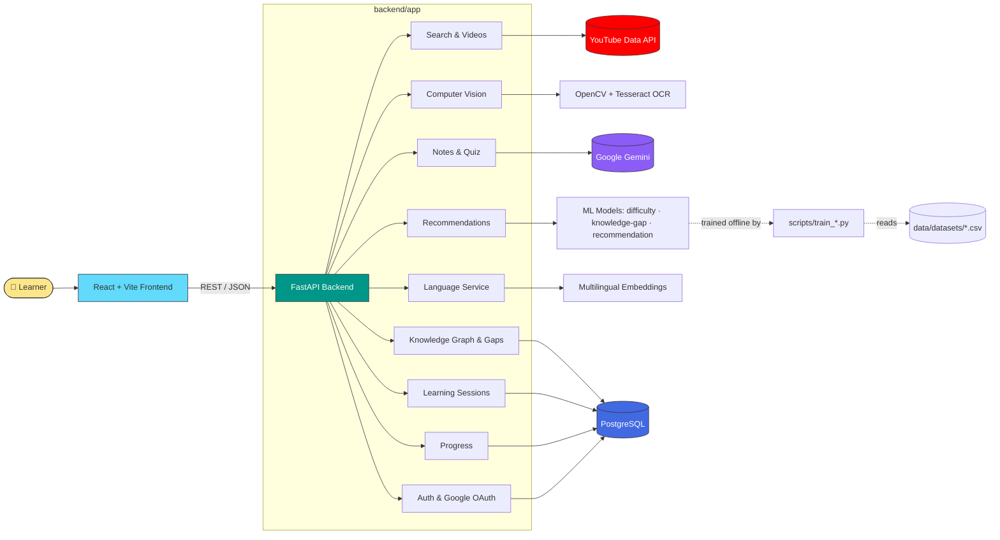
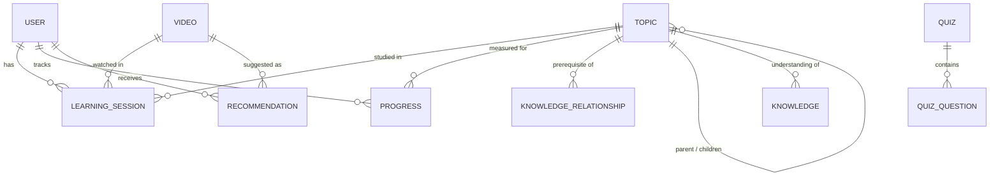

<div align="center">

# 🧠 Learnix

### Turn any YouTube video into a personalized, adaptive learning experience.

AI-driven recommendations · Knowledge-gap detection · Computer-vision video analysis · Auto-generated notes & quizzes · Multilingual by design

[](https://www.python.org/)
[](https://fastapi.tiangolo.com/)
[](https://react.dev/)
[](https://vitejs.dev/)
[](https://www.postgresql.org/)
[](LICENSE)

[Features](#-features) • [Tech Stack](#-tech-stack) • [Architecture](#-architecture) • [Project Structure](#-project-structure) • [Quick Start](#-quick-start) • [Dependencies](#-dependencies) • [API](#-api-overview)

</div>

---

## 💡 What is Learnix?

Most people learn from YouTube — but YouTube doesn't know what you already know. **Learnix** sits on top of video content and adds the layer YouTube is missing: it tracks what you understand, spots the gaps in your knowledge, and guides you to the next right video, in your language, at your level.

Feed it a topic. It searches, analyzes the video's transcript *and* its visuals (slides, code, diagrams), scores its difficulty, and slots it into a knowledge graph. As you learn, it builds a picture of you — and recommends what to watch next, generates notes, and quizzes you to check it stuck.

## ✨ Features

<table>
<tr>
<td width="33%" valign="top">

### 🔐 Accounts & Auth
- Email/password + JWT sessions
- Google OAuth login
- Secure password reset flow

</td>
<td width="33%" valign="top">

### 🎯 Personalization Engine
- ML-based difficulty scoring
- Knowledge-gap prediction
- Adaptive video recommendations

</td>
<td width="33%" valign="top">

### 🕸️ Knowledge Graph
- Topic prerequisite mapping
- Readiness checks before new topics
- Gap detection per learner

</td>
</tr>
<tr>
<td width="33%" valign="top">

### 👁️ Computer Vision
- Slide / code / diagram detection
- Scene & text detection (OCR)
- Visual complexity scoring

</td>
<td width="33%" valign="top">

### 📝 AI Study Tools
- Gemini-generated notes
- Auto-generated quizzes + grading
- Semantic topic search

</td>
<td width="33%" valign="top">

### 🌍 Multilingual
- Language auto-detection
- Multilingual embeddings
- Notes & quizzes in `en` / `bn` / `hi`

</td>
</tr>
</table>

## 🛠️ Tech Stack

<table>
<tr><th>Layer</th><th>Technology</th></tr>
<tr>
<td><strong>Frontend</strong></td>
<td>

React 19 · React Router 7 · Vite 6 · Axios

</td>
</tr>
<tr>
<td><strong>Backend</strong></td>
<td>

FastAPI 0.115 (Python 3.12) · Uvicorn (ASGI) · Pydantic v2

</td>
</tr>
<tr>
<td><strong>Database & ORM</strong></td>
<td>

PostgreSQL · SQLAlchemy 2.0 · Alembic (migrations) · `psycopg2`

</td>
</tr>
<tr>
<td><strong>Auth & Security</strong></td>
<td>

JWT (`python-jose`) · `passlib` + `bcrypt` · Google OAuth 2.0

</td>
</tr>
<tr>
<td><strong>AI / ML</strong></td>
<td>

Google Gemini (`google-genai`) · `sentence-transformers` · `scikit-learn` · `numpy` · `joblib`

</td>
</tr>
<tr>
<td><strong>Computer Vision</strong></td>
<td>

OpenCV (`opencv-python-headless`) · Tesseract OCR (`pytesseract`) · Pillow

</td>
</tr>
<tr>
<td><strong>NLP / i18n</strong></td>
<td>

`langdetect` · `youtube-transcript-api` · custom multilingual embeddings & routing

</td>
</tr>
<tr>
<td><strong>Testing</strong></td>
<td>

`pytest` · `pytest-asyncio`

</td>
</tr>
<tr>
<td><strong>Infra / Tooling</strong></td>
<td>

Alembic migrations · `.env`-based config (`pydantic-settings`) · GitHub Actions (`.github/`)

</td>
</tr>
</table>

## 🏗️ Architecture



### Request flow, step by step

1. **Search** — Learner searches a topic → `search` router queries the **YouTube Data API** and returns candidate videos.
2. **Analyze** — `videoes` router pulls transcripts (`youtube-transcript-api`) and hands frames to the **computer-vision pipeline** (slide/code/diagram/scene/text detectors + visual-complexity scoring).
3. **Score** — The `ai/` layer scores difficulty and computes embeddings (`sentence-transformers`) for semantic search and topic classification.
4. **Learn** — Learner starts a session (`learning` router); every interaction is logged as an event tied to a `LearningSession`.
5. **Track** — `progress` and `knowledge` routers update the learner's `Progress` and check the `KnowledgeRelationship` graph for gaps and readiness.
6. **Recommend** — `recommendations` router combines the ML recommendation model + knowledge gaps to suggest the next video/topic.
7. **Reinforce** — `notes` and `quiz` routers call **Gemini** to generate study notes and quizzes, translated via the `multilingual/` package when needed.

<details>
<summary><strong>🗺️ Data model (entity relationships)</strong> — click to expand</summary>
<br>



**Core tables:** `User`, `Topic`, `Video`, `LearningSession`, `Progress`, `Recommendation`, `Knowledge`, `KnowledgeRelationship`, `Quiz`, `QuizQuestion`.

</details>

## 🗂️ Project Structure

```
learnix/
├── backend/
│   ├── app/
│   │   ├── ai/                            # ML & generative AI layer
│   │   │   ├── difficulty_model.py           # Video difficulty classifier (RandomForest)
│   │   │   ├── knowledge_gap_model.py        # Knowledge-gap classifier
│   │   │   ├── recommendation_model.py       # Recommendation ranker
│   │   │   ├── embeddings.py                 # Sentence-transformer embeddings
│   │   │   ├── semantic_search.py            # Embedding-based topic/video search
│   │   │   ├── topic_classifier.py           # Topic classification
│   │   │   ├── knowledge_graph.py            # Prerequisite graph logic
│   │   │   └── gemini_client.py              # Google Gemini wrapper
│   │   │
│   │   ├── api/                            # FastAPI routers (one per domain)
│   │   │   ├── auth.py · google.py            # Auth, JWT, Google OAuth
│   │   │   ├── search.py · videoes.py         # Search & video analysis
│   │   │   ├── learning.py · recommendations.py
│   │   │   ├── knowledge.py · progress.py
│   │   │   ├── notes.py · quiz.py
│   │   │   ├── vision.py · language.py
│   │   │
│   │   ├── computer_vision/                # Frame-level video analysis
│   │   │   ├── frame_extractor.py
│   │   │   ├── slide_detector.py · code_detector.py
│   │   │   ├── diagram_detector.py · text_detector.py
│   │   │   ├── scene_detector.py
│   │   │   ├── visual_complexity.py
│   │   │   └── vision_pipeline.py             # Orchestrates all detectors
│   │   │
│   │   ├── core/                           # Cross-cutting concerns
│   │   │   ├── security.py · middleware.py
│   │   │   ├── logging.py · exceptions.py
│   │   │   └── cache.py · rate_limiter.py
│   │   │
│   │   ├── database/                       # Persistence layer
│   │   │   ├── connection.py · crud.py
│   │   │   └── migrations/
│   │   │
│   │   ├── models/                         # SQLAlchemy ORM models
│   │   │   ├── user.py · topic.py · video.py
│   │   │   ├── learning_session.py · progress.py
│   │   │   ├── recommendation.py · knowledge.py · quiz.py
│   │   │
│   │   ├── multilingual/                   # i18n / NLP
│   │   │   ├── language_detector.py · language_router.py
│   │   │   ├── multilingual_embeddings.py
│   │   │   ├── multilingual_summarizer.py · multilingual_quiz.py
│   │   │
│   │   ├── schemas/                        # Pydantic request/response models
│   │   ├── services/                       # Business logic (one per feature)
│   │   │   ├── youtube_service.py · transcript_service.py
│   │   │   ├── difficulty_service.py · recommendation_service.py
│   │   │   ├── knowledge_gap_service.py · learning_path_service.py
│   │   │   ├── personalization_service.py · progress_service.py
│   │   │   ├── notes_service.py · quiz_service.py
│   │   │   ├── topic_search.py · video_feature_service.py
│   │   │   ├── google_auth_service.py · email_service.py
│   │   │
│   │   ├── utils/                          # Helpers, validators, scoring, text processing
│   │   ├── config.py                        # Env-driven settings (pydantic-settings)
│   │   └── main.py                          # FastAPI app entrypoint & router wiring
│   │
│   ├── alembic/                              # DB migration scripts + env
│   ├── alembic.ini
│   ├── tests/
│   │   ├── unit/ · integration/
│   │   └── conftest.py
│   ├── requirements.txt
│   ├── runtime.txt                            # Python version pin (3.12)
│   └── .env.example
│
├── frontend/
│   ├── src/
│   │   ├── components/                       # Reusable UI (16 components)
│   │   │   ├── Navbar/ · ProfileMenu/ · SearchBar/
│   │   │   ├── VideoCard/ · VideoGrid/ · RecommendationCard/
│   │   │   ├── KnowledgeMap/ · KnowledgeGap/ · LearningPath/
│   │   │   ├── DifficultyBadge/ · LevelSelector/ · LanguageSelector/
│   │   │   ├── NotesViewer/ · Quiz/ · ProgressChart/ · CVInsights/
│   │   │   ├── ProtectedRoute/ · Loading/ · ErrorMessage/
│   │   │
│   │   ├── pages/                            # Route-level views (13 pages)
│   │   │   ├── Home/ · Login/ · Register/
│   │   │   ├── ForgotPassword/ · ResetPassword/
│   │   │   ├── Search/ · VideoLearning/ · Dashboard/
│   │   │   ├── KnowledgePage/ · LearningPathPage/
│   │   │   ├── Notes/ · QuizPage/ · Profile/ · Settings/
│   │   │
│   │   ├── context/                          # AuthContext, LanguageContext, ThemeContext
│   │   ├── hooks/                             # useAuth, useLanguage, useLearning, useTheme
│   │   ├── services/                          # Axios API clients (auth, search, learning, notes, knowledge, recommendation)
│   │   ├── utils/                              # constants, formatters, validators
│   │   ├── App.jsx · Main.jsx · index.css
│   │
│   ├── index.html
│   ├── vite.config.js
│   ├── package.json
│   └── .env.example
│
├── data/
│   └── datasets/                              # CSV training data (video features, gaps, interactions)
│
├── scripts/                                     # Offline ML pipeline
│   ├── prepare_datasets.py
│   ├── train_difficulty_model.py
│   ├── train_knowledge_gap_model.py
│   └── train_recommendation_model.py
│
├── .github/                                      # CI workflows
├── LICENSE
└── README.md
```

## 🚀 Quick Start

> **Prerequisites:** Python 3.12+, Node.js 18+, PostgreSQL 14+, Tesseract OCR, plus API keys for [YouTube Data API](https://developers.google.com/youtube/v3), [Google Gemini](https://ai.google.dev/), and a Google OAuth client.

### 1️⃣ Clone it

```bash
git clone https://github.com/ankanmaity842-prog/learnix.git
cd learnix
```

### 2️⃣ Backend

```bash
cd backend
python -m venv venv && source venv/bin/activate   # Windows: venv\Scripts\activate
pip install -r requirements.txt

cp .env.example .env       # then fill in DATABASE_URL, JWT_SECRET_KEY,
                            # YOUTUBE_API_KEY, GEMINI_API_KEY, GOOGLE_CLIENT_ID/SECRET

alembic upgrade head       # run migrations
uvicorn app.main:app --reload
```

➡️ API live at **http://localhost:8000** · interactive docs at **http://localhost:8000/docs**

### 3️⃣ Frontend

```bash
cd frontend
npm install
cp .env.example .env       # set VITE_API_URL, VITE_GOOGLE_CLIENT_ID, VITE_GOOGLE_REDIRECT_URI
npm run dev
```

➡️ App live at **http://localhost:5173**

<details>
<summary>🏭 Building for production</summary>
<br>

```bash
npm run build
npm run preview
```

</details>

## 📦 Dependencies

<details>
<summary><strong>Backend — <code>requirements.txt</code></strong> (click to expand)</summary>
<br>

| Package | Version | Purpose |
|---|---|---|
| `fastapi` | 0.115.12 | Web framework |
| `uvicorn[standard]` | 0.34.2 | ASGI server |
| `pydantic` | 2.11.3 | Data validation |
| `pydantic-settings` | 2.9.1 | Env-based config |
| `email-validator` | 2.2.0 | Email validation |
| `sqlalchemy` | 2.0.40 | ORM |
| `psycopg2-binary` | 2.9.10 | PostgreSQL driver |
| `alembic` | 1.15.2 | DB migrations |
| `python-jose[cryptography]` | 3.4.0 | JWT signing/verification |
| `passlib[bcrypt]` | 1.7.4 | Password hashing |
| `bcrypt` | 4.3.0 | Hashing backend |
| `httpx` | 0.28.1 | Async HTTP client |
| `google-genai` | 1.12.1 | Google Gemini SDK |
| `sentence-transformers` | 4.1.0 | Text embeddings |
| `numpy` | 2.2.5 | Numerical computing |
| `scikit-learn` | 1.8.0 | ML models (RandomForest, etc.) |
| `joblib` | 1.4.2 | Model serialization |
| `langdetect` | 1.0.9 | Language detection |
| `youtube-transcript-api` | 1.0.3 | Transcript fetching |
| `opencv-python-headless` | 4.11.0.86 | Computer vision |
| `pytesseract` | 0.3.13 | OCR |
| `Pillow` | 11.2.1 | Image processing |
| `python-multipart` | 0.0.20 | Form/file parsing |
| `pytest` | 8.3.5 | Testing framework |
| `pytest-asyncio` | 0.26.0 | Async test support |

**System dependency:** [Tesseract OCR](https://github.com/tesseract-ocr/tesseract) must be installed on the host (used by `pytesseract`).

</details>

<details>
<summary><strong>Frontend — <code>package.json</code></strong> (click to expand)</summary>
<br>

| Package | Version | Purpose |
|---|---|---|
| `react` | ^19.0.0 | UI library |
| `react-dom` | ^19.0.0 | DOM renderer |
| `react-router-dom` | ^7.5.0 | Client-side routing |
| `axios` | ^1.8.4 | HTTP client |
| `vite` | ^6.2.6 *(dev)* | Build tool / dev server |
| `@vitejs/plugin-react` | ^4.4.1 *(dev)* | React support for Vite |

</details>

## ⚙️ Environment Variables

<details>
<summary><strong>Backend — <code>backend/.env</code></strong></summary>
<br>

| Variable | Description |
|---|---|
| `APP_NAME` | Application name (default: `Learnix`) |
| `APP_VERSION` | Application version |
| `DEBUG` | Enable debug mode |
| `DATABASE_URL` | PostgreSQL connection string (`postgresql+psycopg2://...`) |
| `JWT_SECRET_KEY` | Secret used to sign JWTs |
| `JWT_ALGORITHM` | JWT signing algorithm (default: `HS256`) |
| `JWT_ACCESS_TOKEN_EXPIRE_MINUTES` | Access token lifetime in minutes |
| `PASSWORD_RESET_TOKEN_EXPIRE_MINUTES` | Password reset token lifetime |
| `YOUTUBE_API_KEY` | YouTube Data API key |
| `GEMINI_API_KEY` | Google Gemini API key |
| `GOOGLE_CLIENT_ID` / `GOOGLE_CLIENT_SECRET` | Google OAuth credentials |
| `GOOGLE_REDIRECT_URI` | OAuth callback URL |
| `FRONTEND_URL` | Frontend origin (used for CORS, default `http://localhost:5173`) |

</details>

<details>
<summary><strong>Frontend — <code>frontend/.env</code></strong></summary>
<br>

| Variable | Description |
|---|---|
| `VITE_API_URL` | Base URL of the backend API |
| `VITE_GOOGLE_CLIENT_ID` | Google OAuth client ID |
| `VITE_GOOGLE_REDIRECT_URI` | OAuth redirect URI for the frontend |

</details>

> ⚠️ Never commit real `.env` files — copy from `.env.example` and keep secrets out of version control.

## 🧬 Database Migrations

```bash
alembic revision --autogenerate -m "describe your change"   # after editing models
alembic upgrade head                                          # apply
alembic downgrade -1                                           # roll back one step
```

## 🤖 ML Models & Datasets

Training data lives in `data/datasets/` and feeds three models consumed by `backend/app/ai/` at runtime:

| Script | Trains | Algorithm |
|---|---|---|
| `train_difficulty_model.py` | Video difficulty classifier | `RandomForestClassifier` |
| `train_knowledge_gap_model.py` | Knowledge-gap classifier | `RandomForestClassifier` |
| `train_recommendation_model.py` | Recommendation ranker | `RandomForestRegressor` |

```bash
python scripts/prepare_datasets.py
python scripts/train_difficulty_model.py
python scripts/train_knowledge_gap_model.py
python scripts/train_recommendation_model.py
```

## 📡 API Overview

All routes are prefixed with `/api`. Once the backend is running, explore them live at **`/docs`** (Swagger UI).

<details open>
<summary><strong>Click to expand the full route table</strong></summary>
<br>

| Router | Prefix | Purpose |
|---|---|---|
| `auth` | `/api` | Register, login, logout, current user, password reset |
| `google` | `/api` | Google OAuth login/callback |
| `search` | `/api/search` | Search topics/videos |
| `videoes` | `/api/videos` | Video metadata, transcripts, analysis |
| `recommendations` | `/api` | Personalized and topic-based recommendations |
| `learning` | `/api` | Learning session lifecycle (start, event, progress, complete, history) |
| `notes` | `/api/notes` | AI-generated notes |
| `quiz` | `/api/quiz` | AI-generated quizzes and submission grading |
| `progress` | `/api/progress` | Progress dashboard, weekly/topic breakdowns |
| `knowledge` | `/api` | Knowledge map, gaps, prerequisites, topic readiness |
| `vision` | `/api/vision` | Computer-vision video analysis and frame extraction |
| `language` | `/api/languages` | Supported languages and language detection |

`GET /health` → liveness check · `GET /` → app name/version/status

</details>

## 🧪 Running Tests

```bash
cd backend
pytest
```

Organized under `backend/tests/unit` and `backend/tests/integration`, with shared fixtures in `conftest.py`.

## ☁️ Deployment Checklist

- [ ] Target Python 3.12 (see `runtime.txt`); deploy on any ASGI host (Render, Railway, Fly.io, or a container with Uvicorn/Gunicorn workers)
- [ ] Run `alembic upgrade head` as part of your deploy pipeline
- [ ] Build the frontend (`npm run build`) and serve `frontend/dist` via a static host/CDN
- [ ] Point production `VITE_API_URL` at your deployed backend
- [ ] Install Tesseract OCR on the backend host so computer-vision features work
- [ ] Set `DEBUG=false` and rotate/strengthen `JWT_SECRET_KEY` and all API keys

## 🤝 Contributing

Contributions, issues, and feature requests are welcome!

1. Fork the repo
2. Create your branch (`git checkout -b feature/amazing-thing`)
3. Commit your changes (`git commit -m "Add amazing thing"`)
4. Push and open a PR

## 📄 License

Licensed under the [Apache License 2.0](LICENSE).

---

<div align="center">

If Learnix helped you learn something faster, consider ⭐ starring the repo.

</div>
